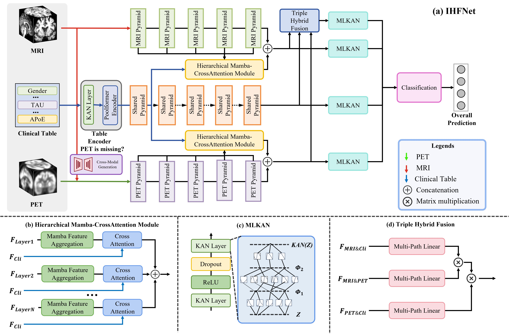

# IHFNet: Incomplete Multimodal Hierarchical Feature Fusion Network for Mild Cognitive Impairment Conversion Prediction


-----

## 1 Paper flowchart




## 2 Source Tree

```
├── /Net
│   ├── api.py
│   ├── basic.py
│   ├── kan.py
│   ├── MultiLayerFusion.py
│   ├── poolformer.py
│   ├── ResnetEncoder.py
├── Config.py
├── Dataset.py
├── loss_function.py
├── main_rebuild.py
├── observer.py
├── README.md
├── utils.py
```

## 3 Dataset Introduction

The dataset for this study is obtained from the Alzheimer's Disease Neuroimaging Initiative (ADNI), specifically the ADNI-1 and ADNI-2 cohorts. To prevent duplication, subjects present in both datasets were removed from ADNI-2. We selected T1-weighted sMRI, FDG-PET, and clinical data, categorized into four groups: normal controls (NC), sMCI, pMCI, and AD. Demographic information of the dataset is shown in Table below. Additionally, PET data is missing for 82 pMCI and 95 sMCI cases in ADNI-1, and for 1 pMCI and 30 sMCI cases in ADNI-2.

The ADNI dataset link: [ADNI | Alzheimer's Disease Neuroimaging Initiative](https://adni.loni.usc.edu/)


## 4 Training Process

We use PyTorch version 2.6.0 with CUDA 11.8, executed on a single Nvidia V100 32GB GPU. We employed a `5-fold cross-validation` approach to ensure robust model evaluation. The model was trained from scratch in two stages, each comprising 150 epochs, with a `batch size of 8` to efficiently manage the data. To optimize the model parameters, we used the `AdamW optimizer` and set the `learning rate to 0.001` to ensure precise adjustments during the training process. Additionally, we implemented the` Cosine Learning Rate Scheduler`, with the hyperparameter $T_{max}$ set to 50, to dynamically adjust the learning rate throughout the training.

### 4.1 training step

To run our train code, please download and preprocess the ADNI dataset first, including the MRI, PET, and clinical modalities, then place the data corresponding to the three modalities into the folder shown below.

```
.
├── /ADNI1/MRI/
│   ├── xx.nii
│   ├── xx.nii
│   └── ....
├── /ADNI1/PET/
│   ├── xx.nii
│   ├── xx.nii
│   └── ...
└── clinical.csv
└── ...
└── ...

```

Then modify the contents of the `Config. py` file and change the corresponding path to the path where your dataset is located.

Finally, run `python main_rebuild.py`.

## 5 Experimental Result

1、The comparative experimental results in ADNI1 datasets.

| Method       | Modality | ACC          | PRE          | BACC         | AUC          | F1           |
| ------------ | -------- | ------------ | ------------ | ------------ | ------------ | ------------ |
| HOPE         | M        | 0.611        | 0.599        | 0.699        | 0.648        | 0.593        |
| Resnet       | M,P      | 0.725        | 0.671        | 0.693        | 0.653        | 0.606        |
| JSRL         | M,P      | 0.582        | 0.580        | 0.566        | 0.571        | 0.580        |
| VAPL         | M,C      | 0.630        | 0.621        | 0.628        | 0.635        | 0.651        |
| Diamond      | M,P      | 0.736        | 0.719        | 0.693        | 0.638        | 0.591        |
| HFBSurv      | M,P,C    | 0.740        | 0.701        | 0.714        | 0.711        | 0.630        |
| IMF          | M,P,C    | <u>0.756</u> | 0.740        | 0.710        | 0.720        | 0.605        |
| IHF(w/o CMG) | M,P,C    | **0.781**    | **0.805**    | **0.741**    | **0.747**    | <u>0.658</u> |
| IHF          | M,P,C    | 0.737        | <u>0.708</u> | <u>0.723</u> | <u>0.738</u> | **0.666**    |

2、The comparative experimental results in ADNI2 datasets.

| Method       | Modality | ACC          | PRE          | BACC         | AUC          | F1           |
| ------------ | -------- | ------------ | ------------ | ------------ | ------------ | ------------ |
| HOPE         | M        | 0.701        | 0.706        | 0.645        | 0.624        | 0.505        |
| Resnet       | M,P      | 0.809        | 0.721        | 0.683        | 0.709        | 0.510        |
| JSRL         | M,P      | 0.650        | 0.600        | 0.655        | 0.694        | 0.519        |
| VAPL         | M,C      | 0.712        | <u>0.750</u> | 0.672        | 0.623        | 0.561        |
| Diamond      | M,P      | 0.818        | 0.739        | 0.682        | 0.645        | 0.509        |
| HFBSurv      | M,P,C    | 0.813        | 0.701        | 0.688        | 0.672        | 0.539        |
| IMF          | M,P,C    | 0.838        | 0.737        | 0.713        | 0.757        | 0.564        |
| IHF(w/o CMG) | M,P,C    | <u>0.840</u> | 0.722        | <u>0.723</u> | **0.839**    | **0.591**    |
| IHF          | M,P,C    | **0.856**    | **0.777**    | **0.735**    | <u>0.812</u> | <u>0.584</u> |

